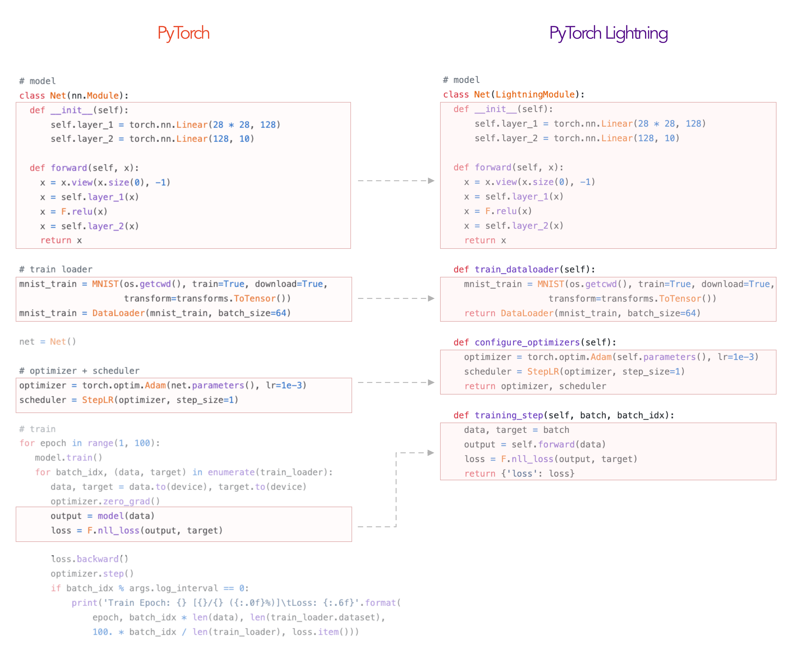
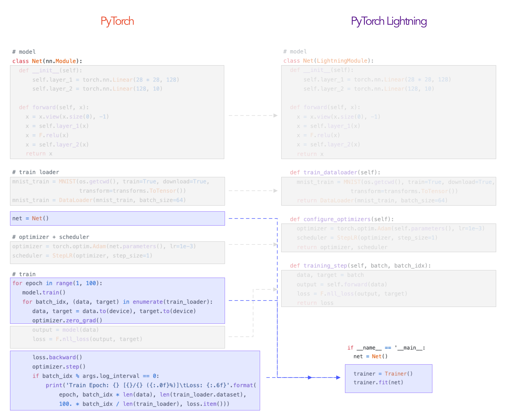

[Lightning](https://pytorch-lightning.readthedocs.io/en/stable/new-project.html) helps structure PyTorch code by separating research from engineering. It’s more of a style guide than a framework.

In Lightning, your code is divided into three parts:

1. **Research code** → Placed in the [LightningModule](https://pytorch-lightning.readthedocs.io/en/latest/lightning-module.html).
2. **Engineering code** → Eliminated and handled by the [Trainer](https://pytorch-lightning.readthedocs.io/en/latest/trainer.html).
3. **Non-essential research code** (e.g., logging) → Moved to Callbacks.

### Refactoring Research Code into LightningModule

The rest is automated by the Trainer:

## Why Use Lightning?

As your project grows—adding GPU/TPU training, 16-bit precision, and more—you’ll spend more time engineering than researching. Lightning automates and rigorously tests these components, letting you focus on research.
